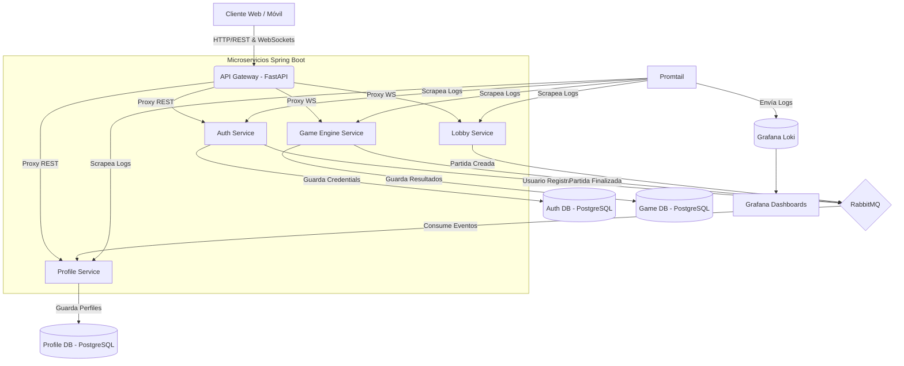
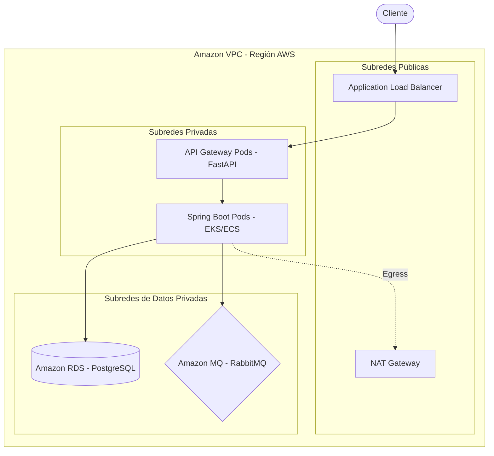

# 🦈 Hungry Shark Royale - Backend Architecture

¡Bienvenido al repositorio del backend de **Hungry Shark Royale**! Este proyecto es un sistema multijugador masivo en tiempo real basado en una arquitectura de microservicios resiliente, reactiva y escalable.

---

## 🏗️ Diagrama de Arquitectura Lógica

El backend está diseñado utilizando el estilo arquitectónico de **Microservicios** y el patrón **Event-Driven Architecture (EDA)**. El Gateway actúa como barrera Zero Trust, mientras que los microservicios se comunican asíncronamente mediante colas de mensajes para garantizar el desacoplamiento temporal y espacial.



---

## ☁️ Diagrama de Despliegue Estratégico (AWS)

Para llevar este proyecto a producción en Amazon Web Services (AWS) asegurando alta disponibilidad (HA) y tolerancia a fallos, se sugiere la siguiente topología de despliegue:



### Componentes AWS Sugeridos:
- **EKS / ECS Fargate:** Para orquestar los microservicios (Spring Boot y FastAPI).
- **Amazon RDS (Aurora PostgreSQL):** Bases de datos administradas y escalables.
- **Amazon MQ (RabbitMQ):** Para la mensajería asíncrona totalmente gestionada.
- **ALB (Application Load Balancer):** Punto de entrada único que enruta tráfico REST y mantiene sesiones persistentes para WebSockets.
- **Route 53:** Gestión de DNS.

---

## 🚀 Cómo Empezar (Getting Started)

### Prerrequisitos
- **Docker** y **Docker Compose** instalados.
- Java 17 y Maven (Opcional, si deseas compilar manualmente).
- Python 3.10+ (Opcional, para el Gateway).

### Ejecución Local

1. **Clona el repositorio:**
   ```bash
   git clone https://github.com/tu-usuario/hungry-shark-backend.git
   cd hungry-shark-backend
   ```

2. **Configura el entorno:**
   Verifica el archivo `.env` en la raíz (generado o proporcionado en la configuración).

3. **Levanta la infraestructura completa:**
   Utiliza Docker Compose para levantar Bases de Datos, RabbitMQ, Servicios y Observabilidad:
   ```bash
   docker-compose up --build -d
   ```

4. **Verificación:**
   - API Gateway: `http://localhost:8080`
   - Grafana: `http://localhost:3000` (El dashboard de KPIs ya está pre-configurado).
   - RabbitMQ Management: `http://localhost:15672` (guest/guest).

---

## 📐 Principios de Arquitectura

El diseño de Hungry Shark Royale está guiado por patrones modernos para sistemas de alta carga:

1. **Desacoplamiento (Microservicios):**
   Las responsabilidades están divididas. `auth-service` maneja exclusivamente identidad, `profile-service` maneja estadísticas, y `game-engine-service` procesa las físicas en tiempo real.
   
2. **Arquitectura Orientada a Eventos (EDA):**
   Para evitar cuellos de botella y llamadas síncronas costosas (HTTP REST), los microservicios comunican actualizaciones de estado (ej: fin de partida) emitiendo eventos a **RabbitMQ**.

3. **Patrón Transaccional Outbox (Resiliencia):**
   Implementado en `auth-service` y `game-engine-service`. Si RabbitMQ se cae, los eventos no se pierden en la memoria volátil; se guardan atómicamente en PostgreSQL y un *Relay Scheduler* reintenta el envío cuando el broker vuelve a estar en línea.

4. **Circuit Breaker (Tolerancia a Fallos):**
   El **API Gateway** cuenta con cortacircuitos por microservicio. Si el servidor de perfiles sufre latencia extrema o caída, su circuito se abre (`OPEN`), protegiendo la red de una tormenta de retries, pero permitiendo que el juego (WebSockets) siga operando.

5. **Server-Authoritative Game Engine:**
   *Nunca confíes en el cliente.* El frontend envía solicitudes de movimiento; el backend en memoria (`ActiveGameState`, `MovementValidator`) calcula velocidades máximas y tiempos. Cualquier intento de *Speed Hack* es ignorado silenciosamente.

---

## 💎 Principios S.O.L.I.D. Aplicados

El código fuente en Java y Python fue escrito rigurosamente respetando SOLID:

- **S - Single Responsibility Principle (SRP):** 
  Las clases están especializadas. En `game-engine-service`, las colisiones están en `CollisionDetector`, el puntaje en `ScoreCalculator`, y el routing STOMP en `GameController`.
  
- **O - Open/Closed Principle (OCP):** 
  El uso de interfaces y manejadores de eventos (ej: `@EventListener`) permite agregar nuevos listeners (como notificaciones push) sin tocar el código central que emite el evento.
  
- **L - Liskov Substitution Principle (LSP):** 
  Los interceptores y manejadores de excepciones globales (`@ControllerAdvice`) extienden y reemplazan limpiamente comportamientos base sin romper contratos HTTP, retornando siempre `ErrorResponseDto` estandarizados.
  
- **I - Interface Segregation Principle (ISP):** 
  En vez de repositorios monolíticos, JPA se utiliza con repositorios atómicos (`GameSessionRepository`, `OutboxEventRepository`), evitando inyectar métodos innecesarios a los servicios.
  
- **D - Dependency Inversion Principle (DIP):** 
  El acoplamiento se maneja mediante Inyección de Dependencias. Todo, desde clientes REST (`httpx` en Python) hasta `ActiveGameManager` en Java, se inyecta por constructor, facilitando pruebas unitarias exhaustivas con Mocks.

---

## 📌 Estrategia de Versionamiento

El proyecto adopta **Semantic Versioning (SemVer 2.0.0)** con el formato `MAJOR.MINOR.PATCH`:

- **MAJOR (1.x.x):** Cambios arquitectónicos grandes o rotura de contratos de API REST / WebSockets.
- **MINOR (x.1.x):** Nuevas funcionalidades (ej: nuevo tipo de obstáculo en el mapa) que son retrocompatibles.
- **PATCH (x.x.1):** Corrección de bugs, ajustes de *Circuit Breakers* o *Throttling*.

### Git Flow Simplificado:
- `main`: Rama estable, siempre desplegable a Producción.
- `develop`: Integración continua de nuevas features.
- `feature/*`: Ramas efímeras para desarrollo de HU/KAN.

---
*Desarrollado con arquitectura resiliente para soportar el apetito insaciable de miles de tiburones simultáneos.* 🦈🌊
